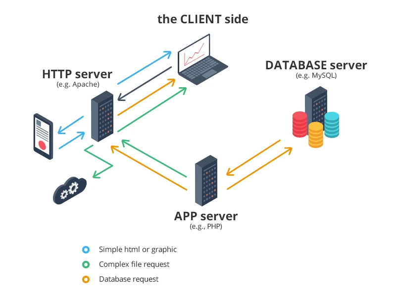
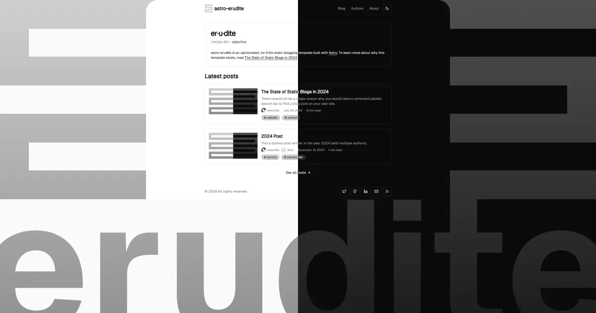
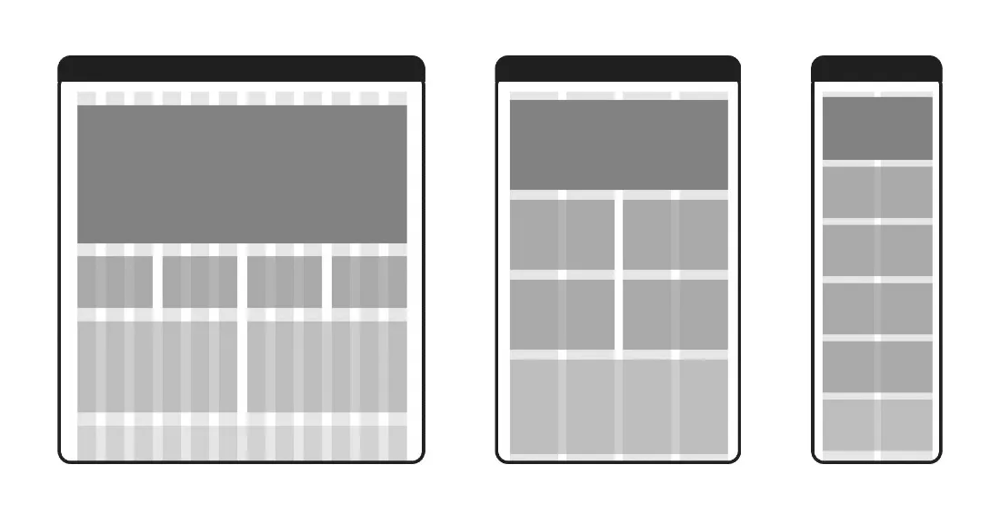
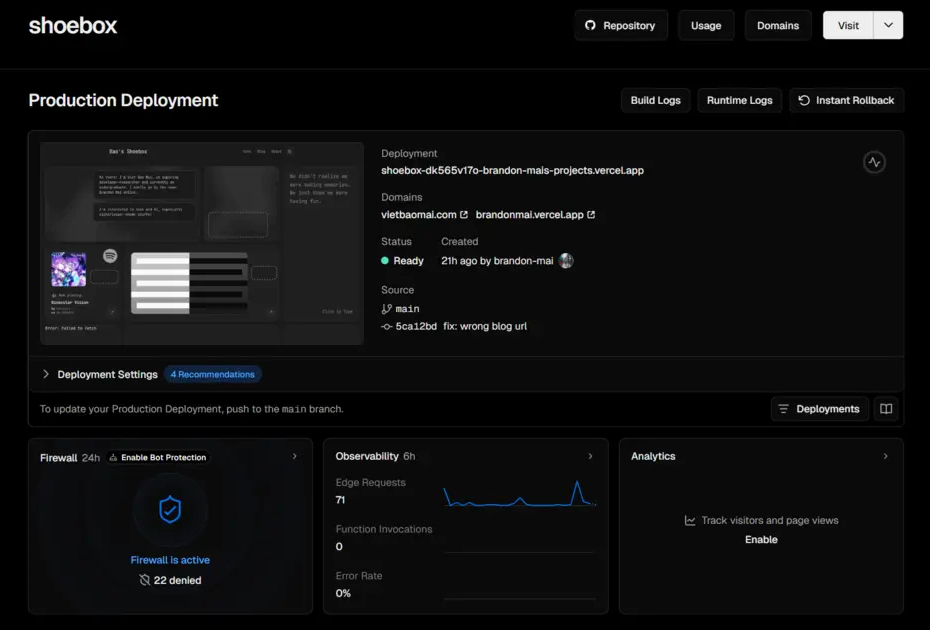

## Inspiration

My initial plan this year (2025) was to make a personal site for contact information and project listings and whatnot. I have been into jotting down my thoughts and experiences as random notes on my phone, but never arranged them into proper writings. I have also dabbled in UI/UX design and frontend development for school projects, but never put those skills to good real-world use. For most people (me included), a plain BoW site would be sufficient.

It was not until coming across a respectable [senior of mine's blog](https://blog.tnminh.com/) that I decided to put a little more effort into this personal space. Plus who wants to be grouped with most people? So I digged deeper and this post documents my journey.

## The traditional paradigm

Once upon a time, standing up even a modest blog was a genuine engineering undertaking. At the very least you had to think in two layers: a **frontend** — the HTML, CSS, and JavaScript that a visitor's browser would render — and a **backend** — the server-side process handling requests, routing, and any dynamic logic. For a blog specifically, you also needed somewhere to store your posts and media, a database to index them, and ideally a **CMS** (Content Management System) so that writing a new entry didn't mean hand-editing raw files on a server. Stack all of that together and you were looking at provisioning a VPS or a dedicated server, configuring a web server like Nginx or Apache, wiring up a database, deploying a CMS like WordPress or Ghost, and setting up SSL — before a single word of actual content was written.

Then came the operational overhead: you owned the machine (or rented it), which meant **you** were responsible for uptime, security patches, scaling when traffic spiked, and backups when something inevitably went wrong. Even "managed" hosting trimmed only some of that surface area.

  
  

    Much simplified diagram courtesy of [ddi-dev.com](https://ddi-dev.com/blog/programming/how-choose-technology-stack-web-application-development/)
  

By 2025, most of that stack has been quietly abstracted away by the tooling. Static-site generators compile your content at build time so there's no backend process to babysit at runtime. Platforms like Vercel or Netlify handle deployment, CDN distribution, and SSL in one `git push`. Markdown files in your totally free GitHub repository *are* your CMS — no database, no admin panel, no nothing. If you're really lazy, a generic site like those SaaS landing pages can be whipped up in a few minutes. But since I was going for a more personal site, I'd do the extra mile of design myself or at least:

## Finding a template

A quick Google search for "personal blog tech stack" would yield some combinations of \*insert a modern JS framework\*, Tailwind CSS, and static site hosting on either GitHub Pages or Vercel. Hence my first stop was Vercel's [Find your Template](https://vercel.com/templates) site, I'm a sane person and would prefer not to build this from the ground up. What I found there did not disappoint: the [template](https://vercel.com/templates/next.js/tailwind-css-starter-blog) that allegedly my senior adopted for his blog. We're off to a great start!

Settling with that same template though would be boring, plus it was (subjectively, in my whole opinion) "bloated" with overly complicated features for a starter's blog such as CMS and comment sections. As I sifted through the community examples and derivations, one blog caught my attention: [enscribe.dev](https://enscribe.dev/). The blog is based on a template made by the creator **enscribe** himself too, and that is what I adopted for my site. The template is [astro-erudite](https://astro-erudite.vercel.app/).

  

There are so many great things about astro-erudite, which you can learn more about by reading [this post here](/blog/the-state-of-static-blogs) from the original creator about what constitutes a great blogging template. I particularly adore it for these 3 points:

1. Astro's markdown rendering in tandem with MDX for component-style content. In simpler terms, I can draft in the familiar markdown format while occasionally embedding JavaScript components like videos or charts to leverage reader experience. All of which will be seamlessly compiled into suitable components for web display.

2. Minimalistic color theme out of the box, with painless theme management via CSS variables.

3. The removal of forementioned complicated features for an uncomplicated blog. The day this blog grows to dozens of authors and zillions of regular visitors isn't coming anytime soon. It's unlikely that I need site analytics, and even more unlikely for comments section or a CMS.

In short, save yourself some time and sanity by picking a template/design that resonates with you and suits your needs. Some helpful resources you might want to check out:
- Reddit for the experienced ones' advices, especially [r/webdev](https://www.reddit.com/r/webdev/) and [r/webhosting](https://www.reddit.com/r/webhosting/).
- Vercel's [Find your Template](https://vercel.com/templates) or any similar site to get inspired and find something you want to work with.
- GitHub to find other users' derivations more suitable for your needs, once you got the gist of what you want to achieve. Make good use of search syntax and hashtags because the generic search results are ass.

## Adding my design touches

A cloned template is ready to be deployed once you're done inputting your own content and information. But a one-size-fits-all template has never been enough for me. One does not have to be a design expert to have their own design preferences, and in 2025 one also does not have to be a web developer/designer to bring those preferences to life.

I have always been a fan of the grid layout or "bento grid" to be more playful with words. The idea is to have a grid of widgets, each with its own content and style, that can be rearranged to create a unique layout. This aesthetic is popular in modern design and it's easy to see why: it's organized, minimal, and visually appealing.

  
  
Simplified example of a responsive grid layout

  

    
    
iOS widgets layout courtesy of [readdle.com](https://readdle.com/blog/iphone-widgets-ios14)

  

  

    
    
Windows 8 Start Menu courtesy of [geekwire.com](https://www.geekwire.com/2012/analyst-windows-8-i-start-menu-it/)

  

So I adopted one for this blog's homepage! Each box/tile/widget would be a mini-canvas to showcase my interests or whatever web-dev ideas I had in mind.

## Deployment made easy

This template's demo is deployed on Vercel itself, so in some ways it's made to be deployed this way in mind. I believe it should be the same case for any template you opt for from Vercel's [Find your Template](https://vercel.com/templates) site. And if you're interested in other platforms e.g. GitHub Pages, look online for general guidance or the template repo's Issues/PRs section directly.

There's been controveries surrounding Vercel's pricing and whatever [political stuffs](https://www.youtube.com/watch?v=jy6qY-fEAjA) out there. Doesn't take away the fact that Vercel's deployment process is too effortless, to the point that I did not learn anything along the way because Vercel did all the heavy-liftings like server setup/configuration, CI/CD pipeline, etc.

  

The very simplified process is as follows:

1. Connect your site's GitHub repo to a Vercel project.
2. Vercel takes care of almost all the setup and configuration. The first deployment is a breeze!
3. A Vercel's GitHub Action is automatically set up to auto-build and deploy every push to the `main` branch. The subsequent updates and deployments are also a breeze!

The free tier is more than generous for an obscure personal blog like this one. I have never hit the monthly limit, the page loads super fast, and isn't the maintenance too effortless?

## Securing a custom domain

Having a custom domain to put on your profiles is rad but optional. Initially I honestly didn't mind using whatever URL Vercel provided like https://brandonmai.vercel.app/ because I could still choose and change the subdomain anyway? But it was due to some Chinese firms that made me look for and secure my own custom domain.

What did those Chinese firms do?

My uncensored, unaltered full name in Vietnamese is Mai Việt Bảo, and Viet Bao Mai if we follow that Western convention with family name at last. Generally it's shortened as "mvbao" or "baomv", and somehow both mvbao.com and baomv.com were occupied by some Chinese firms… Did they sound like Chinese that much? At that very moment I found an urge to reserve some domains for my identity before all variants of my name are taken away.

My domain registrar of choice is Cloudflare for the clean UI and great pricing. There's almost no markup, and I paid like 10 USD a year for a .com domain (shocker I know, honestly did not expect .com price to be that reasonable given its near-default status). Cloudflare has tons of security and CDN features too that I have not fully experienced, so hopefully I will have time and chance to utilize them in the future.

## Conclusion

And with that, a new blog is up and running! Another pretty vital part of a blog is SEO, but that's for another guide/journal in the future (that is, if I don't get lazy and even bother making this blog more discoverable). I'm quite happy with the result as-is and might play around with it as well as fill in a little more content in the near future.