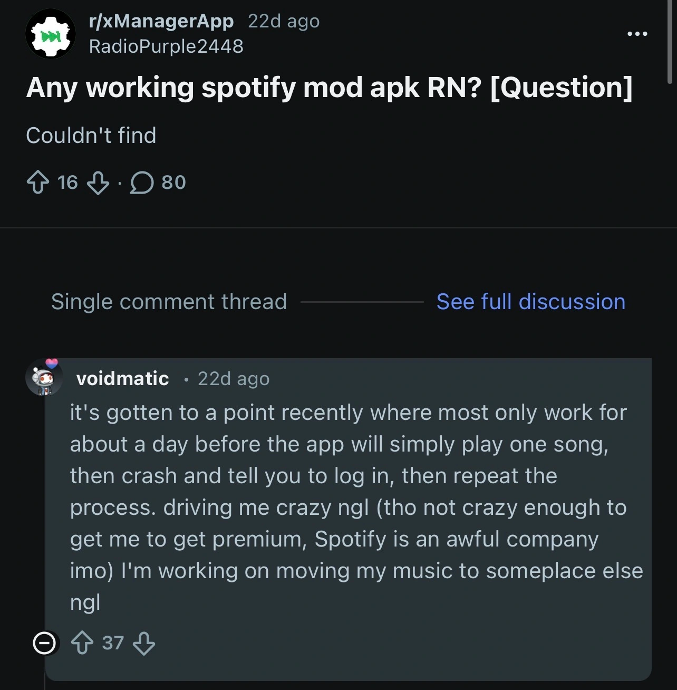
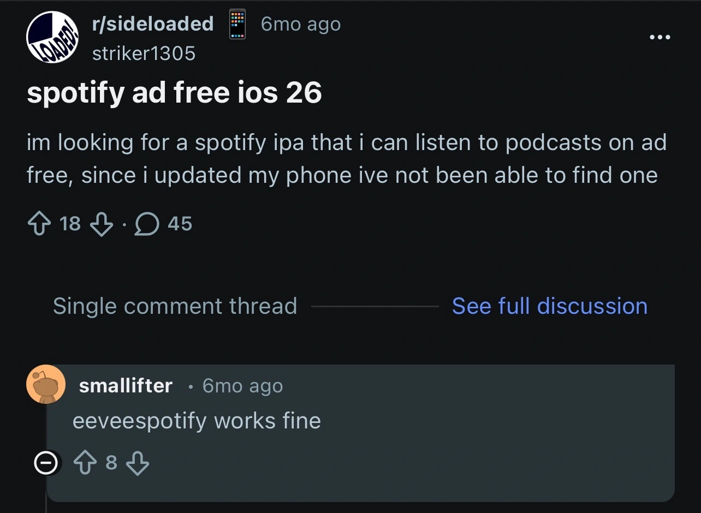
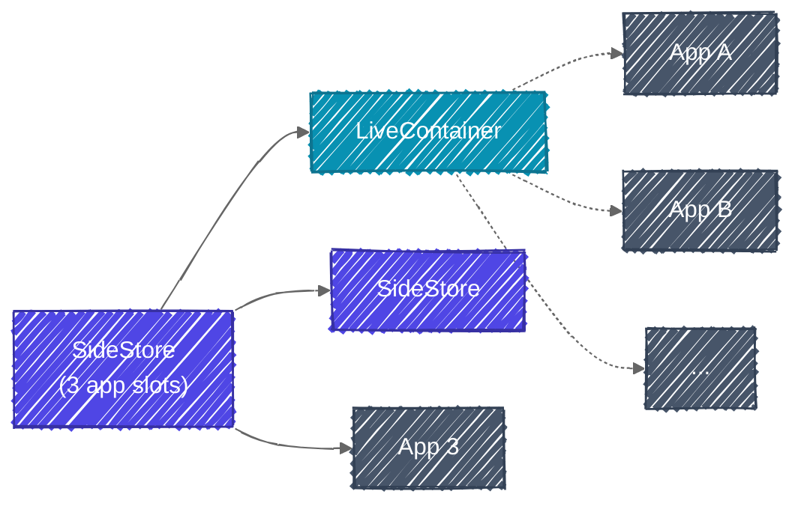
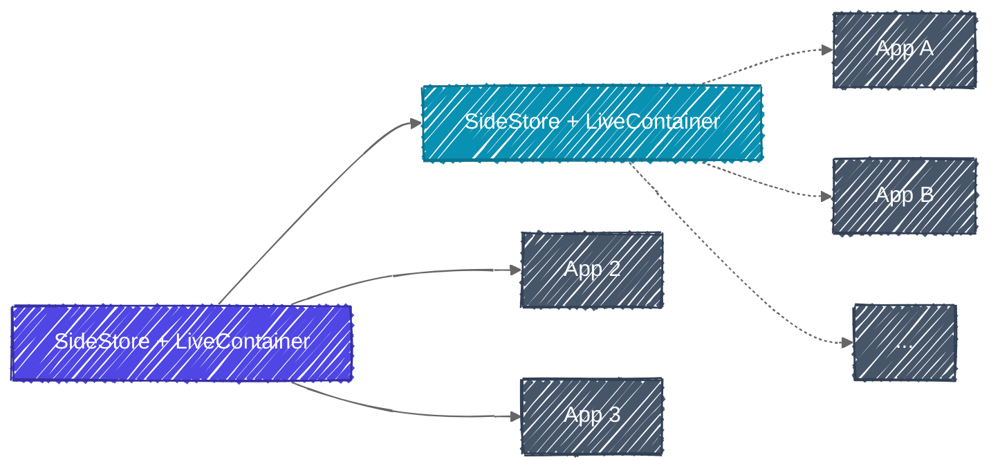
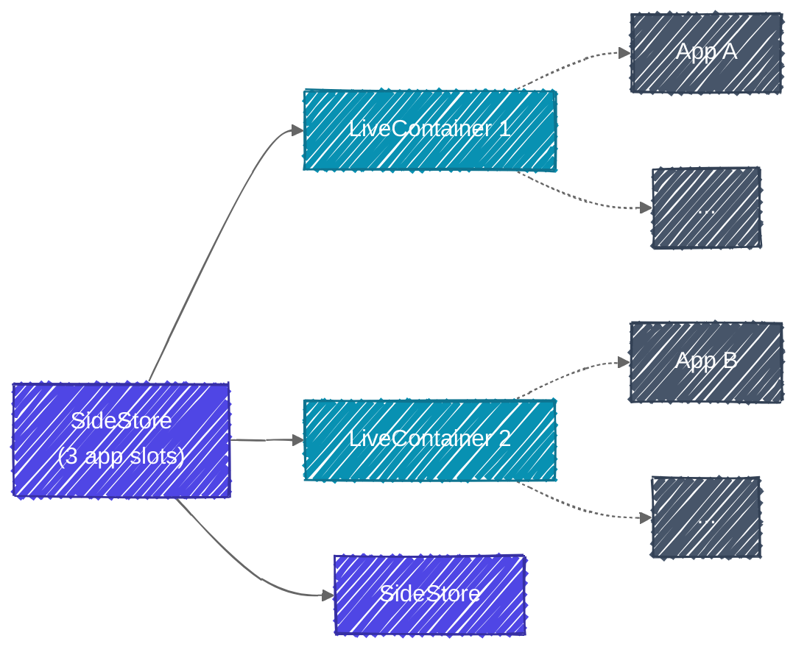

import Callout from '@/components/callout.astro'

Hướng dẫn cài app iOS bên ngoài (sideload) miễn phí, không bị revoke, không cần jailbreak mới nhất 2026 thành công 100% chỉ cần setup với máy tính 1 lần duy nhất.

## Sideload là gì?

Sideload là quá trình cài đặt ứng dụng lên thiết bị mà không thông qua cửa hàng ứng dụng chính thức. Trong bài viết này, từ "sideload" được dùng riêng cho quá trinh cài đặt ứng dụng lên iPhone/iPad mà không thông qua App Store. Các ứng dụng này thường được đóng gói dưới dạng các file IPA (có đuôi .ipa), tương tự file APK trên Android.

## Sideload có gì hay?

File IPA, tương tự APK trên Android, chính là "con ngựa thành Troy" đưa những ứng dụng lạ vào thiết bị của bạn, là chìa khoá mở ra sự tự do cho việc sử dụng iPhone/iPad. Ứng dụng torrent, emulator, ứng dụng beta, ứng dụng mod hack, etc. you name it.

Trước đây, sự khó khăn của việc sideload thường được đem lên bàn cân khi so sánh iOS với Android và luận điểm thường thấy là "iOS mượt, bảo mật cao vs. Android mở, dễ tuỳ chỉnh." Nhưng khoảng cuối 2025 trở lại đây, với việc [Google dự định siết chặt việc cài đặt ứng dụng ngoài](https://www.engadget.com/apps/google-will-block-sideloading-of-unverified-android-apps-124521174.html) với mô hình tương đối giống Apple thì sự tách biệt trên đang dần bị lung lay.

Do đó, việc có thể sideload dễ dàng và bền lâu trên iOS sẽ xoá nhoà khoảng cách hay thậm chí đem lại lợi thế lớn cho iOS so với Android. Một điểm thú vị là một số ứng dụng cho iOS đang được maintain tốt hơn Android (cũng có thể vì lý do technical nào đó như ứng dụng Android dễ bị patch hơn, idk).

  

    

      
    

    

      
    

  

  

    Spotify mod cho iOS (phải/dưới) vẫn hoạt động tốt, trong khi mod cho Android (trái/trên) thường xuyên phải thở oxy
  

## Thông thường sideload diễn ra thế nào?

Quá trình sideload và sử dụng ứng dụng có thể được đơn giản hoá bằng các bước sau:

1. Bật chế độ Nhà phát triển (Developer Mode) trong Cài đặt
2. Cài app từ file IPA bằng phần mềm bên thứ ba trên máy tính (3uTools, iMazing, etc.) hoặc trên chính iPhone/iPad (Scarlet, AppCake, etc.)
3. Xác minh ứng dụng trong Cài đặt và sử dụng bình thường

Xác minh ứng dụng về cơ bản là quá trình "sign" ứng dụng bằng "chứng chỉ/cert" của tài khoản Apple của bạn để đảm bảo ứng dụng an toàn và được tin cậy. Với một tài khoản Apple cơ bản, có thể sign được tối đa **3 apps** hoặc **10 App IDs** trong tối đa **7 ngày**.

<Callout title="App ID là gì?" variant="note" defaultOpen={false}>
App ID (trong ngữ cảnh sideload) là một chuỗi ký tự duy nhất được tạo ra bởi Apple để xác định **ứng dụng** hoặc **tính năng** của ứng dụng (gọi chung là App Extensions). Một ứng dụng có thể sử dụng nhiều hơn 1 App ID nếu có:

- **Main app**: Tất cả ứng dụng sử dụng cơ bản 1 App ID cho ứng dụng chính.
- **Extensions**: Một số tính năng mở rộng của ứng dụng, được Apple coi như mini-app độc lập với App ID riêng như widget, notification, share sheet, etc.
</Callout>

Nếu không muốn bị giới hạn, bạn sẽ phải tham gia Apple Developer Program với chi phí **$99/năm**, một cái giá khá chát với những người chỉ muốn sideload và không lập trình chuyên nghiệp cho iOS. Nhưng cũng có một số cách workaround như sau:

- **Sign app bằng cert của người khác**: Cert thường từ Developer Program của một công ty nào đó được chia sẻ công khai hoặc được bán với giá rẻ hơn mức giá $99/năm. Tuy nhiên, cách này có rủi ro bị revoke cert bất cứ lúc nào.
- **Jailbreak/Semi-jailbreak thiết bị**: Cách làm mạnh tay nhất nhưng không phải phiên bản iOS nào cũng có thể làm được. Ngoài ra, jailbreak cũng có thể làm mất bảo hành thiết bị và gây ra các vấn đề bảo mật.
- **Tự tay refresh trong vòng 7 ngày**: Thuận theo tự nhiên, hơi mất công nhưng không gặp bất cứ rủi ro gì. Chúng ta sẽ tập trung vào cách này.

## Giải pháp hoàn hảo: SideStore và LiveContainer

**SideStore** là một open-source app trên iOS/iPadOS giúp bạn sideload ứng dụng bền lâu bằng cách tự động hoá quá trình sign và refresh (sign lại ứng dụng trong vòng 7 ngày) bằng Shortcuts, dùng máy tính để setup ban đầu và chỉ cần Wi-Fi cho những lần refresh sau.

**LiveContainer** là một open-source app trên iOS/iPadOS hoạt động như một app launcher (hay _container_) giúp bạn chạy được không giới hạn số lượng các ứng dụng IPA khác trong đó. Theo một nghĩa nào đó, LiveContainer là chìa khoá để bạn vượt qua giới hạn 3 apps.

<Callout title="Vậy nên cài IPA nào trong SideStore hay LiveContainer?" variant="note" defaultOpen={false}>

App cài bằng SideStore được tính là một app chính thức, có thể đa nhiệm ngang hàng với các app khác và sử dụng các tính năng nâng cao như notif, widget, etc. Các app cài trong LiveContainer gần như không thể đa nhiệm đúng nghĩa (có thể, nhưng ở chế độ cửa sổ thay vì chạy trong nền). Do đó, ưu tiên cao nhất vẫn là cài trong SideStore.

Giả sử cả Spotify và YouTube đang được cài trong LiveContainer. Để mở YouTube, Spotify phải được đóng lại. Do đó, mình luôn ưu tiên cài các ứng dụng cần chạy trong nền cho audio hoặc PiP như Spotify hay YouTube trong SideStore.

</Callout>

Cách cơ bản nhất là setup SideStore với máy tính, sau đó setup LiveContainer trong SideStore. Chúng ta sẽ còn 1 slot trong SideStore (cho tổng cộng 3 apps được auto refresh theo giới hạn của tài khoản free), và vô số slot trong LiveContainer như được tối giản ở biều đồ sau:

Các app trong LiveContainer không thể đa nhiệm đúng nghĩa, do đó bạn chỉ có thể mở 1 app từ slot còn lại trong SideStore và 1 app trong LiveContainer cùng lúc — khá gò bó. Mình khuyến khích chọn phương án 2: **SideStore + LiveContainer**. Với việc tích hợp tính năng của SideStore vào LiveContainer, bạn chỉ tốn 1 slot trong SlideStore cho cả SideStore và LiveContainer.

Một mô hình setup khác cũng khá thú vị là sử dụng LiveContainer (LC) thứ 2. Khi này mỗi ứng dụng trong LiveContainer thứ nhất có thể chạy song song trong nền với một ứng dụng trong LiveContainer thứ 2.

## Hướng dẫn cài SideStore + LiveContainer

Các bước cơ bản bao gồm:

1. Sử dụng máy tính để sideload SideStore hoặc SideStore + LiveContainer, tạo pairing file
2. Tải ứng dụng VPN chuyên dụng (StosVPN/LocalDevVPN) và Shortcut để tự động hoá việc refresh các app
3. Cài các app và sử dụng bình thường

Một số tài liệu sau sẽ đi sâu vào các bước hơn:

- [SideStore's documentation](https://docs.sidestore.io/docs/intro)
- [This Gist for SideStore + LiveContainer](https://gist.github.com/SoniaMalki/2b34cfeba427a75e53659cb25fd0289d)

Ngoài ra, mình cũng có note lại một số câu hỏi và vấn đề mình gặp phải trong quá trình cài và sử dụng ở subpost của bài viết này, thường là những vấn đề obscure hơn mà FAQ/Troubleshooting docs không đề cập. Note có thể được truy cập từ outline bên phải 👉 (trên máy tính) hoặc sticky header cạnh trên màn hình 👆 (trên điện thoại).

